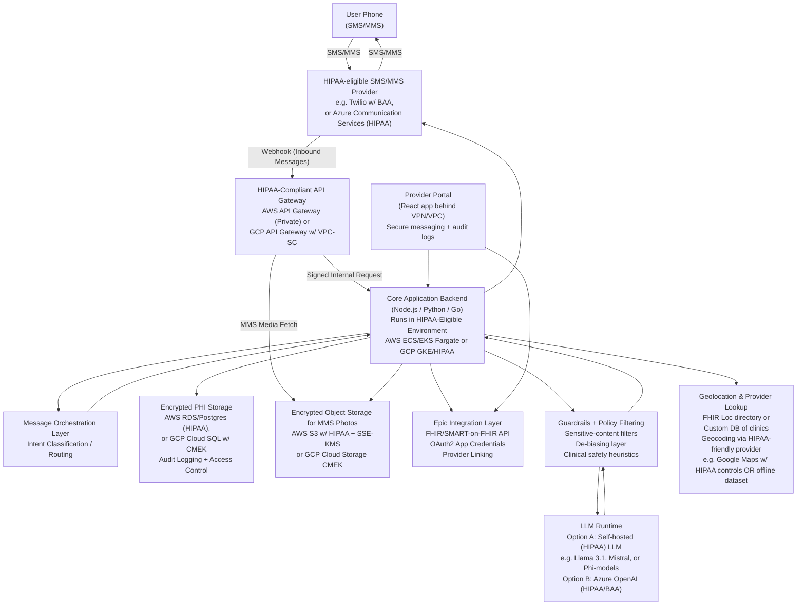

# Architecture Overview

```mermaid
flowchart TD

    %% === CLIENT SIDE ===
    User["User Phone<br/>(SMS/MMS)"] 

    %% === SMS/MMS GATEWAY ===
    Twilio["HIPAA-eligible SMS/MMS Provider<br/>e.g. Twilio w/ BAA,<br/>or Azure Communication Services (HIPAA)"]

    %% === INGRESS LAYER ===
    APIGW["HIPAA-Compliant API Gateway<br/>AWS API Gateway (Private) or<br/>GCP API Gateway w/ VPC-SC"]

    %% === CORE BACKEND ===
    Backend["Core Application Backend<br/>(Node.js / Python / Go)<br/>Runs in HIPAA-Eligible Environment<br/>AWS ECS/EKS Fargate or GCP GKE/HIPAA"]

    MsgRouter["Message Orchestration Layer<br/>Intent Classification / Routing"]

    Storage["Encrypted PHI Storage<br/>AWS RDS/Postgres (HIPAA),<br/>or GCP Cloud SQL w/ CMEK<br/>Audit Logging + Access Control"]

    MediaStore["Encrypted Object Storage for MMS Photos<br/>AWS S3 w/ HIPAA + SSE-KMS<br/>or GCP Cloud Storage CMEK"]

    %% === PROVIDER INTEGRATION ===
    Epic["Epic Integration Layer<br/>FHIR/SMART-on-FHIR API<br/>OAuth2 App Credentials<br/>Provider Linking"]

    %% === LLM + TOOLING ===
    LLM["LLM Runtime<br/>Option A: Self-hosted (HIPAA) LLM<br/>e.g. Llama 3.1, Mistral, or Phi-models<br/>Option B: Azure OpenAI (HIPAA/BAA)"]
    Guardrails["Guardrails + Policy Filtering<br/>Sensitive-content filters<br/>De-biasing layer<br/>Clinical safety heuristics"]

    Geo["Geolocation & Provider Lookup<br/>FHIR Loc directory or<br/>Custom DB of clinics<br/>Geocoding via HIPAA-friendly provider<br/>e.g. Google Maps w/ HIPAA controls OR offline dataset"]

    %% === HEALTHCARE PROVIDER PORTAL ===
    ProviderPortal["Provider Portal<br/>(React app behind VPN/VPC)<br/>Secure messaging + audit logs"]

    %% === FLOWS ===
    %% User sends SMS/MMS
    User -->|"SMS/MMS"| Twilio

    %% Twilio -> APIGW
    Twilio -->|"Webhook (Inbound Messages)"| APIGW

    %% APIGW -> Backend
    APIGW -->|"Signed Internal Request"| Backend

    Backend --> MsgRouter
    MsgRouter --> Backend

    %% MMS image path
    APIGW -->|"MMS Media Fetch"| MediaStore

    %% Backend <-> Storage
    Backend --> Storage
    Backend --> MediaStore

    %% Backend -> LLM pipeline
    Backend --> Guardrails --> LLM --> Guardrails --> Backend

    %% Backend -> Geo lookup
    Backend --> Geo

    %% Epic integration
    Backend --> Epic
    ProviderPortal --> Epic
    ProviderPortal --> Backend

    %% Backend -> User via Twilio
    Backend --> Twilio -->|"SMS/MMS"| User
```